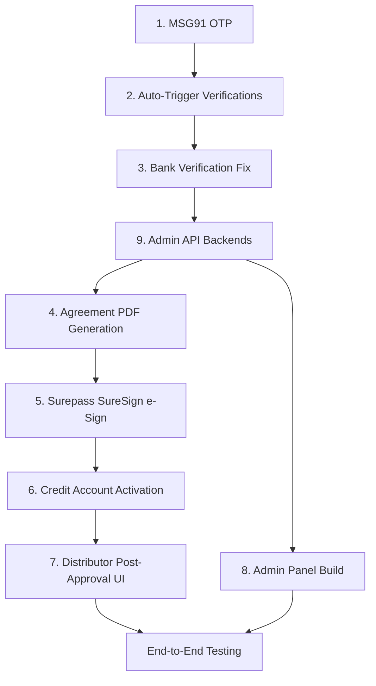

# Kresconet Distributor Approval — Production Pipeline

## Goal
Transform static/dev-mode distributor approval into a fully functional production pipeline with real MSG91 OTP, Surepass verifications, Surepass SureSign e-signing, a full admin panel (Vite+React SPA), and end-to-end order flow.

---

## Resolved Questions

| Question | Answer |
|----------|--------|
| MSG91 credentials | ✅ User has them ready |
| Which admin panel | ✅ Build `admin/` (Vite+React SPA) from scratch |
| e-Sign approach | ✅ Surepass SureSign (`sign_type: "suresign"`) — no Aadhaar needed |

---

## Component Overview

| # | Component | Scope |
|---|-----------|-------|
| 1 | MSG91 OTP Integration | Replace dev-mode OTP with real MSG91 send/verify |
| 2 | Auto-Trigger Verifications | After consent → auto-run PAN/GST/Bank/CIBIL + credit scoring |
| 3 | Bank Verification Fix | Fix `triggerBank()` to fetch real bank details |
| 4 | Agreement PDF Generation | Build credit agreement PDF dynamically from verified data |
| 5 | Surepass SureSign e-Sign | Upload PDF → initialize SureSign → redirect user → callback |
| 6 | Credit Account Activation | Create credit account after agreement signed |
| 7 | Distributor Post-Approval UI | Offer → Accept → Sign → Catalogue → Orders in `ui/` |
| 8 | Admin Panel (Vite SPA) | Full admin dashboard in `admin/` with live API |
| 9 | Admin API Backends | Implement all stubbed `AdminHandler` methods |

---

## Proposed Changes

### Component 1: MSG91 OTP Integration

#### [NEW] [api/internal/service/auth/msg91.go](file:///home/arryaanjain/Desktop/Everything/DistributorApprovalSystem/api/internal/service/auth/msg91.go)
MSG91 HTTP client:
- `SendOTP(mobile, templateID)` → `POST https://control.msg91.com/api/v5/otp` with `authkey` header
- `VerifyOTP(mobile, otp)` → `GET https://control.msg91.com/api/v5/otp/verify?mobile=&otp=` with `authkey` header  
- `ResendOTP(mobile, retryType)` → `POST https://control.msg91.com/api/v5/otp/retry`
- Mobile format: `91XXXXXXXXXX` (country prefix required)

#### [MODIFY] [config.go](file:///home/arryaanjain/Desktop/Everything/DistributorApprovalSystem/api/internal/config/config.go)
Add `MSG91Config` struct: `AuthKey`, `TemplateID`, `SenderID`. Load from env.

#### [MODIFY] [.env](file:///home/arryaanjain/Desktop/Everything/DistributorApprovalSystem/api/.env)
Add: `MSG91_AUTH_KEY`, `MSG91_TEMPLATE_ID`, `MSG91_SENDER_ID`

#### [MODIFY] [service.go](file:///home/arryaanjain/Desktop/Everything/DistributorApprovalSystem/api/internal/service/auth/service.go)
- When `OTP_DEV_MODE=false`: delegate to MSG91 (MSG91 handles OTP generation, storage, verification)
- When `OTP_DEV_MODE=true`: keep current local hash behavior
- `SendOTP()`: call `msg91Client.SendOTP()` instead of generating locally
- `VerifyOTP()`: call `msg91Client.VerifyOTP()` instead of local hash check; still create/fetch distributor record and issue JWT

---

### Component 2: Auto-Trigger Verifications After Consent

#### [MODIFY] [onboarding/service.go](file:///home/arryaanjain/Desktop/Everything/DistributorApprovalSystem/api/internal/service/onboarding/service.go)
- Add `verSvc *verification.Service` and `creditSvc *credit.Service` to constructor
- In `SubmitConsent()`: after recording consent → call `verSvc.TriggerAll()` → call `creditSvc.EvaluateApplication()`
- This auto-runs PAN/GST/Bank/CIBIL verification and credit scoring pipeline in one shot

#### [MODIFY] [main.go](file:///home/arryaanjain/Desktop/Everything/DistributorApprovalSystem/api/cmd/server/main.go)
Wire `verSvc` and `creditSvc` into `svconboarding.New()` constructor.

---

### Component 3: Bank Verification Fix

#### [MODIFY] [verification/service.go](file:///home/arryaanjain/Desktop/Everything/DistributorApprovalSystem/api/internal/service/verification/service.go)
Fix `triggerBank()`: fetch actual bank details via `distRepo.GetBankDetails(ctx, distributorID)` and pass real `accountNumber`/`ifsc` to Surepass.

#### [MODIFY] [distributor.go](file:///home/arryaanjain/Desktop/Everything/DistributorApprovalSystem/api/internal/repository/distributor.go)
Add `GetBankDetails(ctx, distributorID)` query if not present.

---

### Component 4: Agreement PDF Generation

#### [NEW] [api/internal/service/agreement/pdf.go](file:///home/arryaanjain/Desktop/Everything/DistributorApprovalSystem/api/internal/service/agreement/pdf.go)
Generate credit agreement PDF using Go PDF library (e.g., `go-pdf/fpdf`):
- Pull verified data: distributor name, PAN, GST, business profile, credit limit, payment terms
- Generate legal agreement text with all terms
- Include signature placeholder area at specific coordinates (for SureSign)
- Return PDF bytes + signature position coordinates
- Upload PDF to Surepass (or serve from our API for `pdf_pre_uploaded: true`)

---

### Component 5: Surepass SureSign e-Sign

The flow based on user's provided request body:

```
Backend: Generate PDF → Upload to Surepass → Initialize SureSign session
Frontend: User captures iris/fingerprint → Redirect to SureSign URL
Callback: Surepass redirects back → Backend updates agreement status
```

#### [NEW] [api/internal/service/verification/esign.go](file:///home/arryaanjain/Desktop/Everything/DistributorApprovalSystem/api/internal/service/verification/esign.go)
Surepass e-Sign client methods:
- `UploadDocument(ctx, pdfBytes)` → upload PDF to Surepass
- `InitializeESign(ctx, req)` → POST to Surepass e-Sign endpoint with:
  ```json
  {
    "pdf_pre_uploaded": true,
    "expiry_minutes": 10,
    "sign_type": "suresign",
    "config": {
      "positions": {"<page>": [{"x": <x>, "y": <y>}]},
      "skip_otp": false, "skip_email": false
    },
    "redirect_url": "<BASE_URL>/api/v1/agreements/esign-callback",
    "prefill_options": {
      "full_name": "<distributor_name>",
      "user_email": "<distributor_email>",
      "mobile_number": "<distributor_mobile>"
    }
  }
  ```
- Returns: `{ token, url }` — the signing session URL

#### [MODIFY] [agreement/service.go](file:///home/arryaanjain/Desktop/Everything/DistributorApprovalSystem/api/internal/service/agreement/service.go)
- `Sign()` → instead of faking provider ref:
  1. Generate agreement PDF via `pdf.go`
  2. Upload to Surepass  
  3. Initialize SureSign session with distributor details
  4. Return signing URL to frontend
- New method: `HandleESignCallback(ctx, token, status)` → called when Surepass redirects back
  - Update agreement to SIGNED
  - Create credit account
  - Update application status to `credit_active`

#### [NEW] API endpoint: `GET /api/v1/agreements/esign-callback`
Handle Surepass redirect callback after signing completes.

#### [MODIFY] [handler/agreement.go](file:///home/arryaanjain/Desktop/Everything/DistributorApprovalSystem/api/internal/handler/agreement.go)
- `Sign()` returns `{ signing_url }` instead of immediate "SIGNED"
- New `ESignCallback()` handler for redirect

#### [MODIFY] [router.go](file:///home/arryaanjain/Desktop/Everything/DistributorApprovalSystem/api/internal/router/router.go)
Add `GET /agreements/esign-callback` route (public, no auth — Surepass redirects here).

---

### Component 6: Credit Account Activation

#### [MODIFY] [agreement/service.go](file:///home/arryaanjain/Desktop/Everything/DistributorApprovalSystem/api/internal/service/agreement/service.go)
In `HandleESignCallback()` (after agreement signed):
- Fetch accepted offer → `orderRepo.GetOrCreateCreditAccount(ctx, distID, offer.OfferedLimitPaise)`
- Update application status → `credit_active`

#### [MODIFY] [handler/catalogue.go](file:///home/arryaanjain/Desktop/Everything/DistributorApprovalSystem/api/internal/handler/catalogue.go)
Gate catalogue access: check distributor's application status is `credit_active` before returning products. Return 403 otherwise.

---

### Component 7: Distributor Post-Approval UI

#### [MODIFY] [ui/app/page.tsx](file:///home/arryaanjain/Desktop/Everything/DistributorApprovalSystem/ui/app/page.tsx)
Extend the step machine after `"status"`:

| New Step | Trigger | API Calls |
|----------|---------|-----------|
| `offer` | Status is `approved` | `GET /offers/mine` → display limit/terms → Accept/Decline buttons |
| `agreement` | Offer accepted | `GET /agreements/mine` → display terms → "Sign Agreement" button |
| `esign` | Sign clicked | `POST /agreements/{id}/sign` → receive `signing_url` → redirect to Surepass |
| `catalogue` | Status is `credit_active` | `GET /catalogue` → product grid with add-to-cart |
| `cart` | Items added | Show cart, credit/advance split, submit `POST /orders` |
| `orders` | Order placed | `GET /orders` → order list with status tracking |

Update `loadApplicationStatus()` to route to correct step based on status:
- `approved` → offer step
- `offer_accepted` → agreement step  
- `credit_active` → catalogue step

---

### Component 8: Admin Panel (Vite + React SPA)

Build `admin/` from scratch. Tailwind v4 utility classes only (per changelog constraint).

> [!IMPORTANT]
> Need to install `react-router-dom` and `lucide-react` as dependencies.

#### [MODIFY] [admin/.env](file:///home/arryaanjain/Desktop/Everything/DistributorApprovalSystem/admin/.env)
Set `VITE_API_URL=http://localhost:8080/api/v1`

#### [NEW] `admin/src/lib/api.ts`
API client with employee JWT auth (mirrors `ui/lib/api.ts` pattern but uses `kresconet_admin_token`).

#### [NEW] `admin/src/lib/auth.ts`
Auth helpers: `login()`, `logout()`, `getToken()`, `isAuthenticated()`.

#### [MODIFY] `admin/src/App.tsx`
Replace boilerplate with router:
```
/login → LoginPage
/ → DashboardPage (default redirect)
/applications → ApplicationsPage
/applications/:id → ApplicationDetailPage
/orders → OrdersPage
/distributors → DistributorsPage
/policy → PolicyPage
```

#### [NEW] `admin/src/components/layout/AdminLayout.tsx`
Sidebar + header + main content wrapper. Navigation links. Employee profile display.

#### [NEW] `admin/src/pages/LoginPage.tsx`
Employee login form → `POST /auth/employee/login` → store tokens → redirect to dashboard.

#### [NEW] `admin/src/pages/DashboardPage.tsx`
Summary cards: total applications, pending reviews, active distributors, overdue accounts.

#### [NEW] `admin/src/pages/ApplicationsPage.tsx`
- Fetch `GET /admin/applications` (with status filter tabs)
- Application list with status badges, scores, duplicate flags
- Click → navigate to detail page

#### [NEW] `admin/src/pages/ApplicationDetailPage.tsx`
Full application review:
- Distributor info (from `GET /distributors/{id}/summary`)
- Verification results (from `GET /verification/{appId}/results`)
- Credit decision (from `GET /credit/{appId}/decision`)
- Action buttons: **Trigger Verification** → **Run Credit Scoring** → **Approve/Reject/Hold**
- Each action calls real API endpoints

#### [NEW] `admin/src/pages/OrdersPage.tsx`
- Fetch `GET /orders/pending-review`
- Order list with credit/advance split display
- Payment proof viewer (if advance required)
- Actions: Verify Payment → Approve Order → Dispatch

#### [NEW] `admin/src/pages/DistributorsPage.tsx`
- Fetch `GET /distributors` with pagination
- Distributor list with credit status, outstanding, risk grade

#### [NEW] `admin/src/pages/PolicyPage.tsx`
- Display active credit policy matrix (score bands, credit ladder, payment terms)

---

### Component 9: Admin API Backends

#### [NEW] [api/internal/handler/admin.go](file:///home/arryaanjain/Desktop/Everything/DistributorApprovalSystem/api/internal/handler/admin.go)
Extract `AdminHandler` from `registry.go` into proper implementation:

```go
type AdminHandler struct {
    distRepo   *repository.DistributorRepository
    verRepo    *repository.VerificationRepository
    creditRepo *repository.CreditRepository
    verSvc     *verification.Service
    creditSvc  *credit.Service
}
```

Methods:
- `ListApplications` → query applications with status filter, join distributor names, paginate
- `GetApplication` → full detail: distributor + business + docs + verifications + score + decision
- `ApproveApplication` → trigger verification pipeline + credit eval if not done, update status
- `RejectApplication` → update status to `rejected`, record reason + actor
- `HoldApplication` → update status to `hold`
- `ListDistributors` → delegates to existing `distRepo.ListAll()`
- `GetDistributor` → delegates to existing `distRepo.GetByID()`

#### [MODIFY] [registry.go](file:///home/arryaanjain/Desktop/Everything/DistributorApprovalSystem/api/internal/handler/registry.go)
Remove `AdminHandler` stub struct and stub methods (moved to `admin.go`).

#### [MODIFY] [distributor.go](file:///home/arryaanjain/Desktop/Everything/DistributorApprovalSystem/api/internal/repository/distributor.go)
Add `ListApplications(ctx, statusFilter, limit, offset)` query.

#### [MODIFY] [main.go](file:///home/arryaanjain/Desktop/Everything/DistributorApprovalSystem/api/cmd/server/main.go)
Wire `AdminHandler` with real services instead of empty struct.

---

## File Change Summary

### API (Go Backend)
| File | Action | Components |
|------|--------|------------|
| `service/auth/msg91.go` | NEW | 1 |
| `service/auth/service.go` | MODIFY | 1 |
| `config/config.go` | MODIFY | 1 |
| `.env` | MODIFY | 1 |
| `service/onboarding/service.go` | MODIFY | 2 |
| `service/verification/service.go` | MODIFY | 3 |
| `repository/distributor.go` | MODIFY | 3, 9 |
| `service/agreement/pdf.go` | NEW | 4 |
| `service/verification/esign.go` | NEW | 5 |
| `service/agreement/service.go` | MODIFY | 5, 6 |
| `handler/agreement.go` | MODIFY | 5 |
| `router/router.go` | MODIFY | 5 |
| `handler/catalogue.go` | MODIFY | 6 |
| `handler/admin.go` | NEW | 9 |
| `handler/registry.go` | MODIFY | 9 |
| `cmd/server/main.go` | MODIFY | 2, 9 |

### UI (Next.js Distributor Portal)
| File | Action | Components |
|------|--------|------------|
| `ui/app/page.tsx` | MODIFY | 7 |

### Admin (Vite + React SPA) — All NEW
| File | Components |
|------|------------|
| `admin/.env` | 8 |
| `admin/src/App.tsx` | 8 |
| `admin/src/lib/api.ts` | 8 |
| `admin/src/lib/auth.ts` | 8 |
| `admin/src/components/layout/AdminLayout.tsx` | 8 |
| `admin/src/pages/LoginPage.tsx` | 8 |
| `admin/src/pages/DashboardPage.tsx` | 8 |
| `admin/src/pages/ApplicationsPage.tsx` | 8 |
| `admin/src/pages/ApplicationDetailPage.tsx` | 8 |
| `admin/src/pages/OrdersPage.tsx` | 8 |
| `admin/src/pages/DistributorsPage.tsx` | 8 |
| `admin/src/pages/PolicyPage.tsx` | 8 |

**Total: ~28 files** (6 new API, 10 modified API, 1 modified UI, 11 new Admin)

---

## Execution Order



**Phase A (Backend Foundation):** Components 1 → 2 → 3 → 9
**Phase B (e-Sign Pipeline):** Components 4 → 5 → 6
**Phase C (Frontends — parallel):** Components 7 + 8
**Phase D:** End-to-end verification

---

## Verification Plan

### Build Verification
- `go build ./cmd/server/` — API compiles
- `cd admin && npm run build` — Admin compiles

### API Smoke Tests
- `POST /auth/otp/send` with MSG91 (real SMS delivery)
- `POST /onboarding/consent` → verify auto-trigger chain runs
- `GET /admin/applications` → returns real data
- `POST /admin/applications/{id}/approve` → triggers pipeline
- `POST /agreements/{id}/sign` → returns SureSign URL
- `GET /catalogue` → 403 when not `credit_active`, 200 when active

### End-to-End Flow
1. Distributor: OTP → Onboard → Consent → Auto-verify → View Offer → Accept → Sign (SureSign redirect) → Catalogue → Place Order
2. Admin: Login → View applications → Approve → View orders → Dispatch
