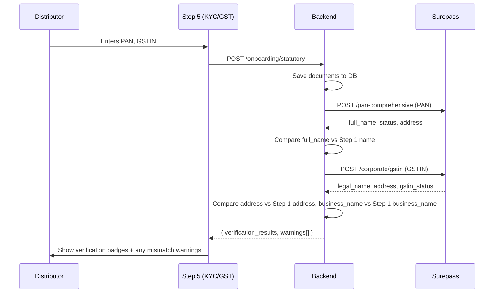
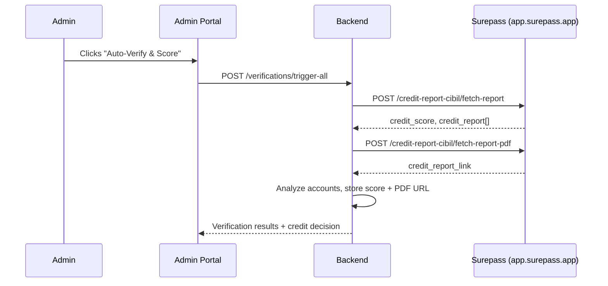

# Surepass Integration Audit — Corrected Flow & Payload Fixes

## Verification Flow Classification

| Endpoint | When | Who Triggers | Purpose |
|----------|------|-------------|---------|
| **PAN Comprehensive** | Step 5 (KYC & GST) submission | **Distributor** (real-time) | Cross-validate name from Step 1 against PAN holder name |
| **Corporate GSTIN** | Step 5 (KYC & GST) submission | **Distributor** (real-time) | Cross-validate address/business name from Step 1 against GST records |
| **CIBIL Report (JSON)** | Admin clicks "Auto-Verify & Score" | **Admin only** | Fetch credit score & account analysis for underwriting |
| **CIBIL Report (PDF)** | Admin clicks "Auto-Verify & Score" | **Admin only** | Generate downloadable CIBIL report PDF link |
| **Bank Verification** | — | Stub (keep as-is) | Future implementation |
| **E-Sign** | Post-onboarding, on Dashboard | **Distributor** (after admin approval) | Distributor signs credit agreement; orders dispatched only after e-sign |

### Distributor-Facing Flow (PAN + GST at Step 5)



### Admin-Only Flow (CIBIL at Underwriting)



---

## Critical Fixes Required

### 1. 🔴 PAN Comprehensive — Request & Response Fix

**File:** [surepass.go](file:///home/arryaanjain/Desktop/Everything/DistributorApprovalSystem/api/internal/service/verification/surepass.go)

#### Request (Lines 134-136)

```diff
 type panRequest struct {
-    IDNUMBER string `json:"id_number"`
+    IDNumber             string `json:"id_number"`
+    GetAddress           string `json:"get_address"`
+    GetContact           string `json:"get_contact"`
+    MaskedAadhaarVariant string `json:"masked_aadhaar_variant"`
 }
```

#### Response (Lines 138-148)

```diff
 type surepassPANResponse struct {
     Data struct {
-        ClientID   string `json:"client_id"`
-        IDNumber   string `json:"id_number"`
-        Name       string `json:"name"`
-        Status     string `json:"status"`
+        ClientID      string `json:"client_id"`
+        PANNumber     string `json:"pan_number"`
+        FullName      string `json:"full_name"`
+        FullNameSplit []string `json:"full_name_split"`
+        Status        string `json:"status"`       // "valid" (lowercase)
+        Category      string `json:"category"`     // "person" / "company"
+        DOB           string `json:"dob"`
+        Gender        string `json:"gender"`
+        Email         string `json:"email"`
+        PhoneNumber   string `json:"phone_number"`
+        AadhaarLinked bool   `json:"aadhaar_linked"`
+        MaskedAadhaar string `json:"masked_aadhaar"`
+        Address       *struct {
+            Full       string `json:"full"`
+            Line1      string `json:"line_1"`
+            Line2      string `json:"line_2"`
+            StreetName string `json:"street_name"`
+            Zip        string `json:"zip"`
+            City       string `json:"city"`
+            State      string `json:"state"`
+            Country    string `json:"country"`
+        } `json:"address"`
     } `json:"data"`
     StatusCode  int     `json:"status_code"`
-    Message     string  `json:"message"`
+    Message     *string `json:"message"`
+    MessageCode string  `json:"message_code"`
     Success     bool    `json:"success"`
 }
```

#### VerifyPAN Method (Lines 151-184)

```diff
 func (c *SurepassClient) VerifyPAN(ctx context.Context, pan, expectedName string) (*PANResult, error) {
-    raw, err := c.post(ctx, "/pan-comprehensive", panRequest{IDNUMBER: pan})
+    raw, err := c.post(ctx, "/pan-comprehensive", panRequest{
+        IDNumber:             pan,
+        GetAddress:           "yes",
+        GetContact:           "yes",
+        MaskedAadhaarVariant: "v1",
+    })
     // ...
-    if resp.Data.Status != "VALID" {
+    if resp.Data.Status != "valid" {
         status = StatusFailed
     } else if expectedName != "" {
-        nameMatch = namesMatch(resp.Data.Name, expectedName)
+        nameMatch = namesMatch(resp.Data.FullName, expectedName)
     // ...
     return &PANResult{
         Status:      status,
-        NameOnPAN:   resp.Data.Name,
+        NameOnPAN:   resp.Data.FullName,
     // ...
 }
```

---

### 2. 🔴 Corporate GSTIN — Endpoint, Request & Response Fix

**File:** [surepass.go](file:///home/arryaanjain/Desktop/Everything/DistributorApprovalSystem/api/internal/service/verification/surepass.go)

#### Request (Lines 190-192)

```diff
 type gstRequest struct {
-    GSTIN string `json:"gstin"`
+    IDNumber string `json:"id_number"`
 }
```

#### Response (Lines 194-207)

```diff
 type surepassGSTResponse struct {
     Data struct {
         ClientID         string `json:"client_id"`
+        GSTIN            string `json:"gstin"`
+        PANNumber        string `json:"pan_number"`
+        BusinessName     string `json:"business_name"`     // trade name
+        LegalName        string `json:"legal_name"`
         GSTINStatus      string `json:"gstin_status"`
-        LegalName        string `json:"legal_name_of_business"`
-        TradeName        string `json:"trade_name"`
         DateOfReg        string `json:"date_of_registration"`
-        PrincipalAddress string `json:"principal_place_address"`
+        Address          string `json:"address"`
         ConstitutionType string `json:"constitution_of_business"`
+        TaxpayerType     string `json:"taxpayer_type"`
+        AadhaarValidation string `json:"aadhaar_validation"`
     } `json:"data"`
 }
```

#### VerifyGST Method (Lines 210-258)

```diff
-    raw, err := c.post(ctx, "/corporate-gstin", gstRequest{GSTIN: gstin})
+    raw, err := c.post(ctx, "/corporate/gstin", gstRequest{IDNumber: gstin})
     // ...
         LegalName:        resp.Data.LegalName,
-        TradeName:        resp.Data.TradeName,
+        TradeName:        resp.Data.BusinessName,
         // ...
-        Address:          resp.Data.PrincipalAddress,
+        Address:          resp.Data.Address,
     // ...
     // Date parsing fix:
-    if t, err := time.Parse("02/01/2006", resp.Data.DateOfReg); err == nil {
+    if t, err := time.Parse("2006-01-02", resp.Data.DateOfReg); err == nil {
```

---

### 3. 🔴 CIBIL Credit Report — Complete Rewrite

**File:** [surepass.go](file:///home/arryaanjain/Desktop/Everything/DistributorApprovalSystem/api/internal/service/verification/surepass.go)

#### Config — Add CIBIL Base URL

**File:** [config.go](file:///home/arryaanjain/Desktop/Everything/DistributorApprovalSystem/api/internal/config/config.go)

```diff
 type SurepassConfig struct {
     BaseURL     string `mapstructure:"SUREPASS_BASE_URL"`
+    CIBILBaseURL string `mapstructure:"SUREPASS_CIBIL_BASE_URL"`
     Token       string `mapstructure:"SUREPASS_TOKEN"`
 }
```

Default: `https://app.surepass.app/production/api/v1`

#### SurepassClient — Add CIBIL URL

```diff
 type SurepassClient struct {
     baseURL      string
+    cibilBaseURL string
     token        string
     httpClient   *http.Client
 }
```

#### Request (Lines 325-328)

```diff
 type cibilRequest struct {
-    MobileNumber string `json:"mobile_number"`
-    PAN          string `json:"pan"`
+    Mobile  string `json:"mobile"`
+    PAN     string `json:"pan"`
+    Name    string `json:"name"`
+    Gender  string `json:"gender"`
+    Consent string `json:"consent"`
 }
```

#### Response (Lines 330-344) — Complete rewrite

The actual response is deeply nested. Key fields:
- `data.credit_score` → **string** (not int)
- `data.credit_report[0].scores[0].score` → string
- `data.credit_report[0].accounts[]` → loan/credit card details
- `data.credit_report[0].response.consumerSummaryresp.accountSummary` → summary stats

#### [NEW] CIBIL PDF Report Method

```go
func (c *SurepassClient) FetchCreditReportPDF(ctx context.Context, mobile, pan, name, gender string) (string, string, error) {
    // POST to cibilBaseURL + "/credit-report-cibil/fetch-report-pdf"
    // Returns: credit_report_link (S3 presigned URL), client_id
}
```

#### FetchCreditReport — Use separate base URL

```diff
-    raw, err := c.post(ctx, "/credit-report-cibil", cibilRequest{...})
+    // Must use cibilBaseURL, not baseURL
+    raw, err := c.postCIBIL(ctx, "/credit-report-cibil/fetch-report", cibilRequest{...})
```

---

### 4. 🟡 E-Sign Config Flags

**File:** [esign.go](file:///home/arryaanjain/Desktop/Everything/DistributorApprovalSystem/api/internal/service/verification/esign.go) (Lines 89-91)

```diff
     payload.Config.Reason = "Kresconet Distributor Credit Agreement Execution"
     payload.Config.AllowDownload = true
+    payload.Config.AcceptVirtualSign = true
+    payload.Config.TrackLocation = true
+    payload.Config.EnforceGeoLocation = true
+    payload.Config.SkipOTP = true
+    payload.Config.SkipEmail = true
```

---

### 5. 🟡 Step 5 Backend — Trigger PAN + GST Verification on Submission

**File:** [service.go (onboarding)](file:///home/arryaanjain/Desktop/Everything/DistributorApprovalSystem/api/internal/service/onboarding/service.go) (Lines 168-198)

Currently `SubmitStatutory` only saves documents and runs duplicate detection. It should also trigger real-time PAN & GST verification and return warnings:

```diff
 func (s *Service) SubmitStatutory(ctx context.Context, distributorID string, in *StatutoryInput) (*StatutoryResult, error) {
     // ... save documents ...
     // ... duplicate detection ...
+
+    // ── Real-time PAN Verification ──────────────────────────────────────
+    var verWarnings []string
+    if s.verSvc != nil && in.PAN != "" {
+        panResult := s.verSvc.VerifyPANOnly(ctx, distributorID, appID, in.PAN, step1Name)
+        if panResult.Status == "mismatch" {
+            verWarnings = append(verWarnings, fmt.Sprintf(
+                "PAN holder name '%s' does not match your registered name '%s'",
+                panResult.NameOnPAN, step1Name))
+        }
+    }
+
+    // ── Real-time GST Verification ──────────────────────────────────────
+    if s.verSvc != nil && in.GSTNumber != "" {
+        gstResult := s.verSvc.VerifyGSTOnly(ctx, distributorID, appID, in.GSTNumber, step1BusinessName)
+        if gstResult.Status == "mismatch" {
+            verWarnings = append(verWarnings, fmt.Sprintf(
+                "GST legal name '%s' does not match business name '%s'",
+                gstResult.LegalName, step1BusinessName))
+        }
+        // Cross-validate address too
+    }
+
+    return &StatutoryResult{
+        DuplicateResult: dupResult,
+        Warnings:        verWarnings,
+        PANVerified:     panResult != nil && panResult.Status == "verified",
+        GSTVerified:     gstResult != nil && gstResult.Status == "verified",
+    }, nil
 }
```

> [!IMPORTANT]
> This requires the onboarding service to have access to the Step 1 data (distributor name, business name, address) for cross-validation. Currently it fetches `dist.Name` and `bp.BusinessName` from the repository — which should already be saved from Step 1.

### 6. Step 5 Frontend — Display Verification Badges & Warnings

**File:** [Step5KycGst.tsx](file:///home/arryaanjain/Desktop/Everything/DistributorApprovalSystem/ui/components/onboarding/Step5KycGst.tsx)

After submission, show:
- ✅ Green badge: "PAN Verified — Name matches" 
- ⚠️ Warning: "PAN holder name 'ARRYAAN BHAVESH JAIN' does not match 'ARRYAAN JAIN'"
- ✅ Green badge: "GST Active — Business name matches"
- ⚠️ Warning: "GST address differs from registered address"

Allow the distributor to proceed despite warnings (they're informational), but flag them for admin review.

---

## Files Modified

### Backend

| File | Action | Description |
|------|--------|-------------|
| [surepass.go](file:///home/arryaanjain/Desktop/Everything/DistributorApprovalSystem/api/internal/service/verification/surepass.go) | MODIFY | Fix PAN, GST, CIBIL request/response structs + methods |
| [esign.go](file:///home/arryaanjain/Desktop/Everything/DistributorApprovalSystem/api/internal/service/verification/esign.go) | MODIFY | Set missing e-sign config flags |
| [service.go (verification)](file:///home/arryaanjain/Desktop/Everything/DistributorApprovalSystem/api/internal/service/verification/service.go) | MODIFY | Add `VerifyPANOnly` and `VerifyGSTOnly` methods for Step 5 real-time calls |
| [service.go (onboarding)](file:///home/arryaanjain/Desktop/Everything/DistributorApprovalSystem/api/internal/service/onboarding/service.go) | MODIFY | Wire PAN+GST verification into `SubmitStatutory`, return warnings |
| [config.go](file:///home/arryaanjain/Desktop/Everything/DistributorApprovalSystem/api/internal/config/config.go) | MODIFY | Add `SUREPASS_CIBIL_BASE_URL` config |
| [.env.example](file:///home/arryaanjain/Desktop/Everything/DistributorApprovalSystem/api/.env.example) | MODIFY | Add `SUREPASS_CIBIL_BASE_URL` |

### Frontend

| File | Action | Description |
|------|--------|-------------|
| [Step5KycGst.tsx](file:///home/arryaanjain/Desktop/Everything/DistributorApprovalSystem/ui/components/onboarding/Step5KycGst.tsx) | MODIFY | Display real-time PAN/GST verification badges and mismatch warnings |
| [page.tsx](file:///home/arryaanjain/Desktop/Everything/DistributorApprovalSystem/ui/app/page.tsx) | MODIFY | Parse verification warnings from Step 5 response |

---

## Verification Plan

### Automated Tests
- `go build ./...` — compile check
- `go test ./...` — existing tests pass
- Add `surepass_test.go` with mock HTTP server for PAN + GST payloads

### Manual Verification
- Test Step 5 with a known PAN (`CZTPJ8269A`) using Surepass playground token
- Verify GST lookup with known GSTIN (`08AKWPJ1234H1ZN`)
- Confirm mismatch warnings display correctly in the UI
